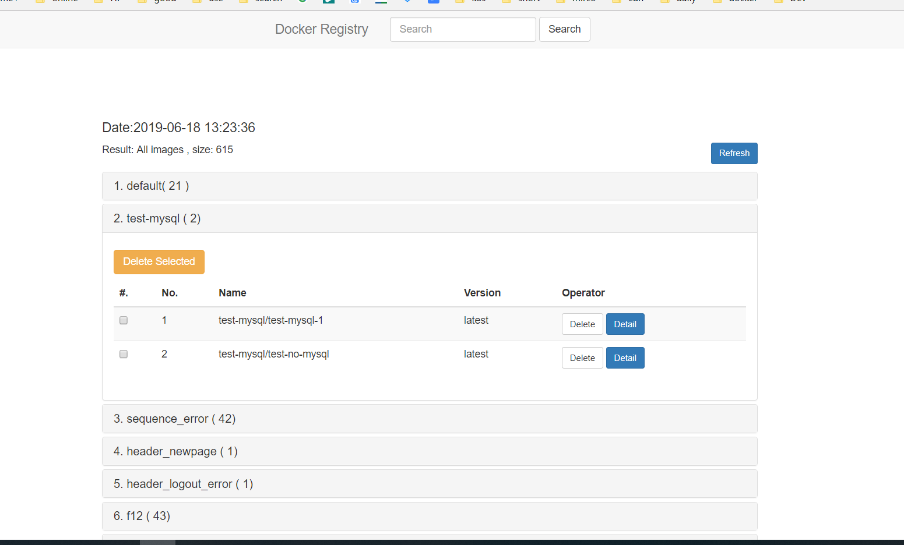

> A dashboard for docker private registry, Not ready, now it can see all docker images in your registry, dan delete it
> make sure to set ip to your own

# build
> mvn clean package

# deploy
> java -jar docker-registry-dashboard-1.0-SNAPSHOT.jar

# broswer

